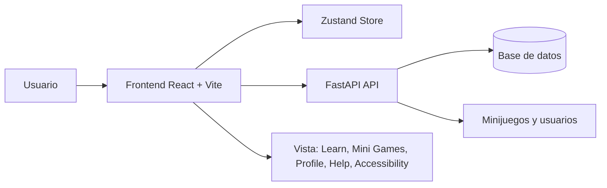

# Arquitectura de Questlish

## Resumen

Questlish es una aplicación web de aprendizaje de inglés construida con dos capas principales:

* **Frontend**: React + Vite + Tailwind CSS + Zustand.
* **Backend**: FastAPI + SQLAlchemy + Pydantic.

La app está pensada para estudiantes de nivel **B1** y organiza el aprendizaje en:

* Lecciones guiadas.
* Minijuegos interactivos.
* Perfil de progreso.
* Ayuda y accesibilidad.

## Qué hace la aplicación

* Muestra una interfaz principal con navegación lateral.
* Permite alternar entre secciones de aprendizaje, minijuegos, perfil, ayuda y accesibilidad.
* Consume datos desde una API FastAPI para:
* autenticación,
* usuarios,
* minijuegos.


* Incluye fallback mock en el frontend para evitar pantallas vacías cuando la API no devuelve datos completos.
* Mantiene el estado global del usuario y accesibilidad con Zustand.

## Arquitectura general



## Frontend

### Tecnologías

* React 19
* Vite
* Tailwind CSS 4
* Zustand
* Axios
* Lucide React

### Estructura principal

* [src/App.jsx](https://www.google.com/search?q=src/App.jsx): orquesta navegación, modales y layout global.
* [src/components/](https://www.google.com/search?q=src/components/): contiene vistas principales.
* [src/store/useQuestlishStore.js](https://www.google.com/search?q=src/store/useQuestlishStore.js): estado global de XP, corazones y accesibilidad.
* [src/services/](https://www.google.com/search?q=src/services/): cliente HTTP y servicios hacia el backend.
* [src/index.css](https://www.google.com/search?q=src/index.css): estilos globales y soporte visual para alto contraste.

### Responsabilidades del frontend

* Renderizar la UI principal.
* Normalizar datos de minijuegos antes de pintar el ejercicio.
* Mostrar estados de carga, vacío y feedback de respuestas.
* Gestionar accesibilidad visual y navegación por teclado.
* Aplicar modo alto contraste en toda la aplicación.

## Backend

### Tecnologías

* FastAPI
* Uvicorn
* SQLAlchemy
* Pydantic

### Estructura principal

* [questlish-backend/app/main.py](https://www.google.com/search?q=questlish-backend/app/main.py): instancia FastAPI y registra routers.
* [questlish-backend/app/routers/](https://www.google.com/search?q=questlish-backend/app/routers/): endpoints de auth, users y minigames.
* [questlish-backend/app/models.py](https://www.google.com/search?q=questlish-backend/app/models.py): modelos ORM.
* [questlish-backend/app/schemas.py](https://www.google.com/search?q=questlish-backend/app/schemas.py): contratos Pydantic.
* [questlish-backend/app/seed.py](https://www.google.com/search?q=questlish-backend/app/seed.py): carga datos iniciales de prueba.

### Responsabilidades del backend

* Exponer la API REST.
* Guardar y recuperar minijuegos, usuarios y progreso.
* Validar respuestas de minijuegos.
* Sembrar datos demo para pruebas locales.

## Flujo de datos de minijuegos

1. El frontend solicita la lista de minijuegos a FastAPI.
2. Si la API devuelve datos parciales, el frontend los normaliza.
3. Si falta contenido, el frontend usa un fallback local con ejercicios completos.
4. El usuario abre un juego y selecciona una respuesta.
5. El frontend verifica la respuesta con la API o con la lógica local de respaldo.
6. Se actualiza XP, corazones y mensajes de feedback.

## Contrato esperado para minijuegos

La API puede responder con una estructura como esta:

```json
{
  "id": "sentence-builder",
  "title": "Sentence Builder",
  "description": "Build clear academic sentences for class discussions.",
  "category": "Grammar",
  "level": "B1",
  "plays": "980 plays",
  "tag": "NEW",
  "instruction": "Choose the best option to complete the sentence.",
  "prompt": "During the seminar, the professor asked us to _____ our ideas clearly.",
  "correctTokenIndex": 1,
  "tokens": [
    {
      "id": "sb-1",
      "word": "presenting",
      "explanation": "Incorrect. After 'asked us to,' the base form of the verb is required."
    },
    {
      "id": "sb-2",
      "word": "present",
      "explanation": "Correct. The base verb follows 'asked us to' and fits the academic context naturally."
    }
  ]
}

```

También puede llegar en variantes compatibles como `options`, `choices` o `question`. El frontend ya normaliza esas formas.

## Cómo ejecutar el proyecto

### 1. Backend (Manual)

Requisitos:

* Python 3.10+ recomendado.
* Entorno virtual activo.

Instalación:

```bash
cd questlish-backend
python -m venv venv
.\venv\Scripts\activate
pip install -r requirements.txt

```

Semilla de datos:

```bash
python -m app.seed

```

Levantar API:

```bash
uvicorn app.main:app --reload

```

La API queda disponible en:

* `http://127.0.0.1:8000`

### 2. Frontend (Manual)

Requisitos:

* Node.js 18+ recomendado.

Instalación:

```bash
cd questlish-fronted
npm install

```

Modo desarrollo:

```bash
npm run dev

```

Build de producción:

```bash
npm run build

```

Vista previa del build:

```bash
npm run preview

```

El frontend normalmente queda disponible en:

* `http://localhost:5173`

## Despliegue con Docker (Recomendado)

El proyecto está completamente containerizado mediante **Docker** y orquestado con **Docker Compose**. Esto permite levantar tanto el Frontend (servido optimizadamente con Nginx) como el Backend (FastAPI con Uvicorn) en entornos aislados de producción con un solo comando.

### Estructura de Contenedores

* **`questlish-frontend`**:
* **Estrategia**: Build multietapa (*Multi-stage build*).
* **Etapa 1 (Builder)**: Utiliza `node:20-alpine` para instalar dependencias y compilar los recursos estáticos mediante `npm run build`.
* **Etapa 2 (Runner)**: Monta los archivos estáticos en un servidor web ultraligero `nginx:alpine` configurado (`nginx.conf`) para soportar enrutamiento SPA sin errores 404.
* **Puerto expuesto**: `3000` (mapeado al puerto interno `80`).


* **`questlish-backend`**:
* Utiliza `python:3.11-slim`.
* Instala todas las dependencias listadas en `requirements.txt` (incluyendo `email-validator` para schemas de Pydantic).
* Levanta el servidor ASGI Uvicorn escuchando en la interfaz global (`0.0.0.0`).
* **Puerto expuesto**: `8000`.


### Requisitos previos

* [Docker Desktop](https://www.docker.com/products/docker-desktop/) instalado y en ejecución.

### Ejecución en un solo paso

Desde la raíz del proyecto (`PROYECTO/`), ejecuta:

```bash
docker compose up --build

```

### Puertos y Servicios Disponibles

| Servicio | URL | Descripción |
| --- | --- | --- |
| **Frontend** | `http://localhost:3000` | Aplicación web en React servida por Nginx. |
| **Backend API** | `http://localhost:8000` | Base de la API REST en FastAPI. |
| **Swagger UI** | `http://localhost:8000/docs` | Documentación interactiva de la API. |

---

## Notas de accesibilidad

* El modo de alto contraste afecta toda la aplicación.
* MiniGames, perfil, ayuda, navbar y topbar leen el estado global de accesibilidad.
* Se usan atributos ARIA y focus visible para navegación con teclado.

## Observación técnica

El frontend incluye normalización defensiva para minijuegos porque el backend o los mocks pueden devolver datos con distintas claves. Eso evita que la tarjeta del ejercicio quede vacía cuando cambie la forma del payload.